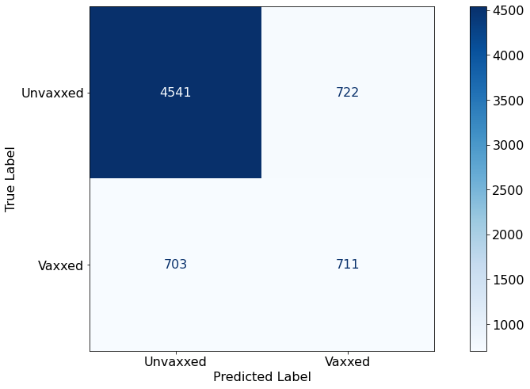
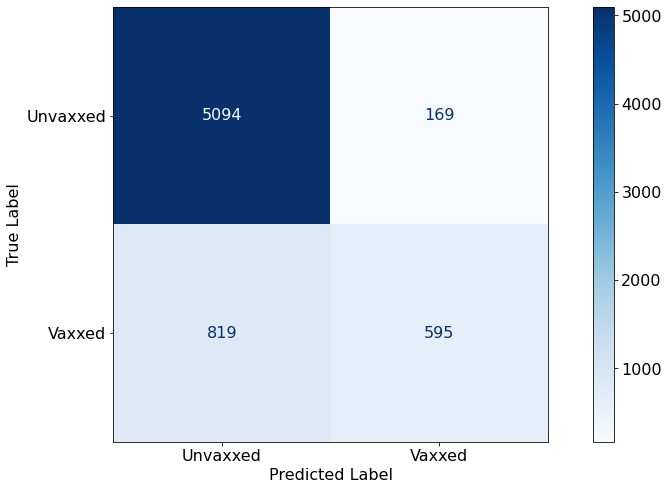
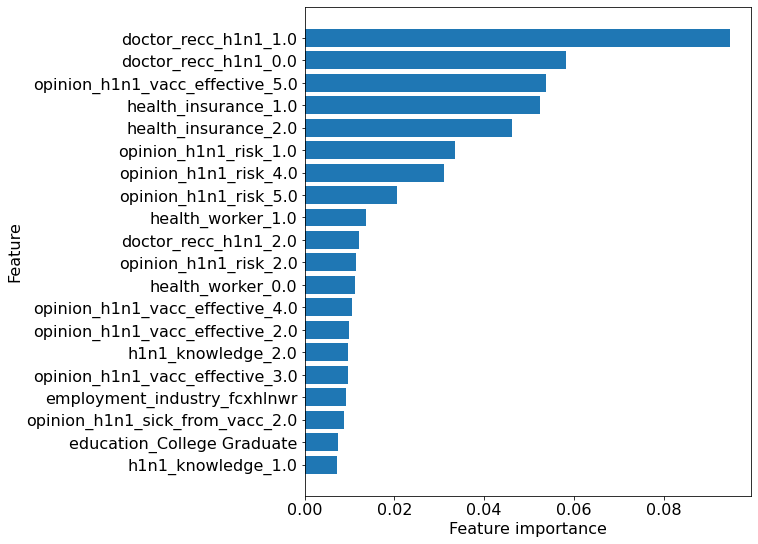
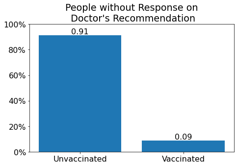
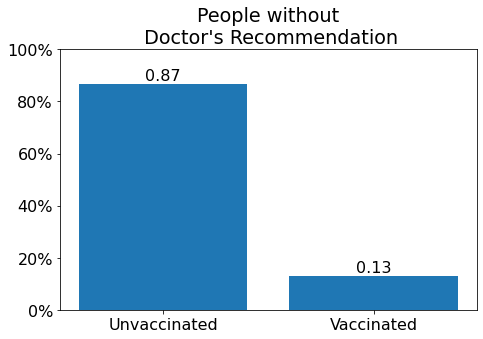
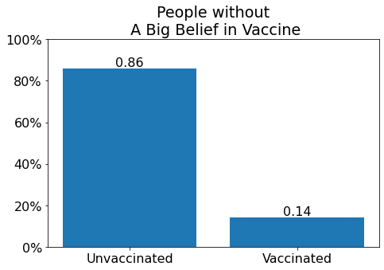
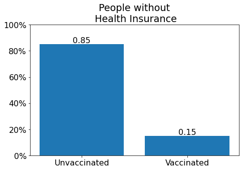

# H1N1 Vaccination Analysis

**Author**: [Jin-hoon Chung](mailto:ddjh204@gmail.com)

# Overview
This project is to study the vaccination rate. Various types of people are taken into the analysis. Some visualizations and tables are included to aid in understanding the progress.

## Business Problem
A survey was conducted to record if people received the H1N1 vaccine. The survey  consists of more than 30 multiple-choice questions including vaccination status, demographics, knowledge level of vaccine, etc. The government wants to reach out to unvaccinated people as much as possible to increase the vaccination rate. It was requested to research what categories of people have a lower rate of vaccinated people.

## Data Understanding
The data for this analysis comes from the National 2009 H1N1 Flu Survey (NHFS). The dataset has more than 30 columns where each column represents a question in the survey. Several columns are removed as they are not relevant to H1N1 vaccine information.

# Data Cleaning
All predictors are categorical. They are either binary or multi-binary. Therefore, no scaling is made.

## Missing Values
The majority of variables have missing values. The number of missing values ranges from 10 to 10k. Since they are categorical, the missing values can be assigned to a new value or to one of the existing values. 

The missing values for all columns except three are assigned to a new value/category. The reason is that it is hard to guess what the missing values mean. The missing values could mean "don't know", "not available", or "out of range". For example, one might not know the health insurance status where the number of missing values for the health insurance question is above 10k.

However, the missing values for three questions regarding opinions about H1N1 were easy to guess. Out of 5 scales, respondents can choose from, there is one option for "don't know". The missing values for these questions are assigned to "don't know".

## Dummy Variables
Dummy variables are created for multi-binary columns using pandas.

# Analysis
Before the analysis, the data is split into a train set and a test set. The train set size is 75% of the whole data.

## Baseline Models
Two baseline models are made using methods of decision tree and random forest.

### Decision Tree Classifier
score | value
--- | ---
CV score         | 78%
X-test score     | 79%
RSME             | 0.46
Recall (no vac)  | 86%
Accuracy         | 79%



### Random Forest Classifier
score | value
--- | ---
CV score         | 85%
X-test score     | 85%
RSME             | 0.38
Recall (no vac)  | 96%
Accuracy         | 85%


## Final Model - Hyperparameter Tuning
Using random forest, hyperparameters are tuned. Random forest is chosen for this process due to higher scores than scores from decision tree. This analysis focuses on the recall score on 0's (unvaccinated respondents) as we want to predict unvaccinated respondents as much as possible. The recall score for 0's shown below is slightly higher while the accuracy stays the same.

### Random Forest Classifier with Hyperparameter Tuned
score | value
--- | ---
CV score         | 85%
X-test score     | 85%
RSME             | 0.38
Recall (no vac)  | 97%
Accuracy         | 85%



## Feature Importance
Below shows a bar chart showing the top 20 dummy variables that have the most impact on the analysis.



# Result
With a 97% recall rate for unvaccinated people and 85% accuracy, this model is reliable to predict if one is unvaccinated.

## Visualization
Some key dummy variables are selected for the visualization for a better understanding.

The unvaccination rate means a rate of people who did not get vaccinated.

- **People who did not respond to the question asking if one had a doctor's recommendation have the highest unvaccination rate.**



- **Anyone without a doctor's recommendation still has a higher unvaccination rate than other categories.**



- **Anyone who did not answer a scale 5 (very effective) on the opinion of the H1N1 vaccine has a high unvaccination rate.**



- **Anyone without health insurance has a high unvaccination rate.** This category does not include people who do not know if they have health insurance or not.



# Conclusions
- **People without a response to a doctor's recommendation question have the lowest vaccination rate.** 
- **People without health insurance tend not to get vaccinated.**
- Using the above two statements, we can see that people who do not pay much attention to their medical status tend not to get vaccinated. 
- **People who do not strongly believe in the H1N1 vaccine tend not to get vaccinated.** It is important to find a way to let people know that the H1N1 vaccine is safe and effective.
- It seems demographics (gender, race, region, etc) have a lower impact on the analysis.

### Next Steps
Further analysis could help the government gain more insight into understanding people without vaccination.

- **Pruning some features.** The survey already has more than 30 questions. We can try to narrow it down to around 10 or more specific features the government is interested in.
- **More research on missing values.** Most of the missing values are marked as "unknown" or "N/A". Per request, the missing values can be assigned with one of the available options in each question.
- **Investigation on the correlation between questions** It seems people with more medical activities have a higher vaccination rate. For example, one who visits a doctor regularly and knows health insurance status tends to get vaccinated. Understanding of correlation might help go further in the analysis.

# Repository Structure

```
├── code
│   ├── __init__.py
│   ├── data_preparation.py
│   ├── visualizations.py
│   ├── EDA_cleaning.ipynb
│   ├── EDA_baseline_model_selection.ipynb
│   ├── EDA_baseline_model_selection_part_2_XGBClassifier.ipynb
│   └── EDA_RFC_Hyperparameter_Tuning.ipynb
├── data
├── images
├── __init__.py
├── README.md
├── Vaccination_Analysis.pdf
└── Vaccination_Analysis.ipynb
```